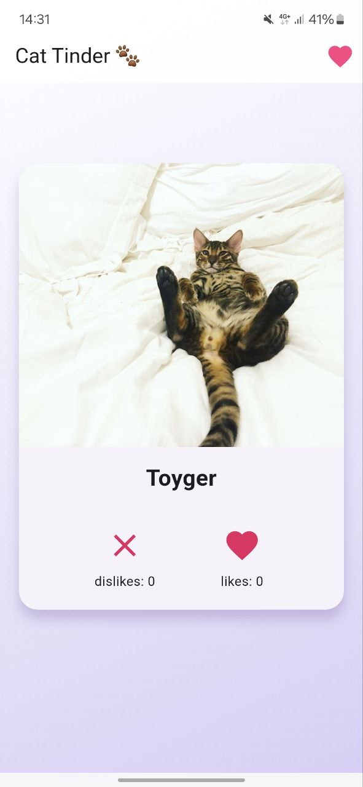
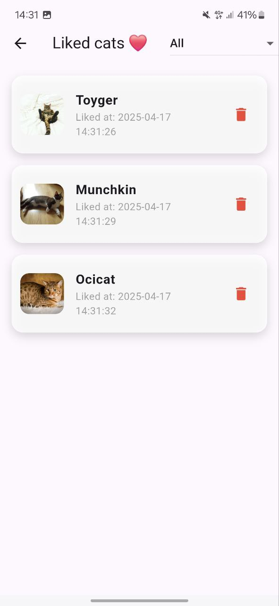
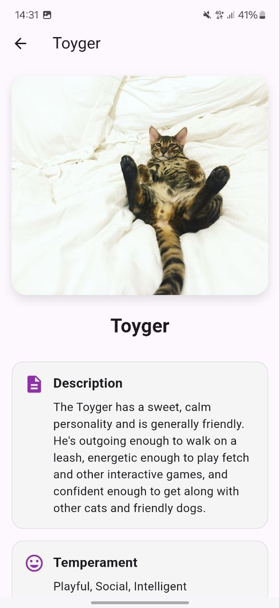
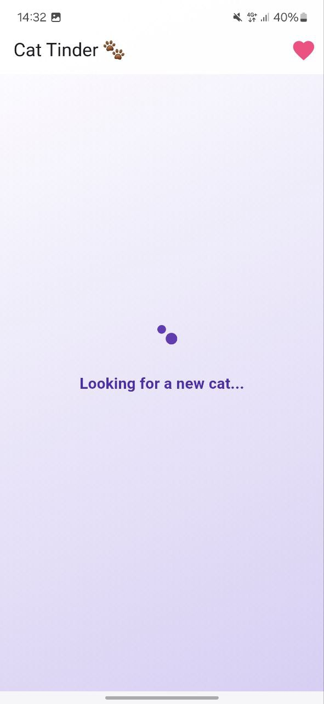
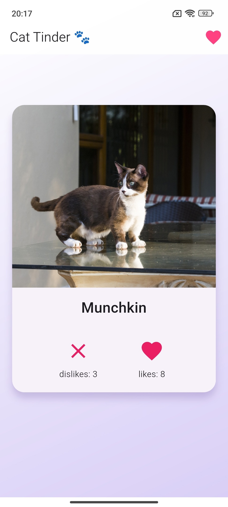

# Cat Tinder

Cat Tinder — это увлекательное приложение, которое позволяет вам знакомиться с очаровательными котиками и их породами. Просто свайпайте вправо, чтобы лайкнуть котика, или влево, чтобы пропустить. Приложение ведет подсчет ваших лайков и предоставляет доступ к списку понравившихся котиков, чтобы вы могли вернуться к своим фаворитам в любое время.

Кроме того, вы можете нажать на изображение котика, чтобы перейти на отдельный экран с подробной информацией о его породе, включая описание, темперамент и происхождение.🐾

Реализованные функции
-----

1. Листание карточек:
   - Свайп вправо для лайка (❤️).
   - Свайп влево для дизлайка (❌).

2. Понравившиеся котики (страница доступна при нажатии на сердечко в правом верхнем углу):
   - Возможность сохранять понравившихся котиков.
   - Удаление котиков из избранного.
   - Просмотр описания каждого котика (при нажатии на него)
 
3. Детальная информация (страница доступна при нажатии на карточку котика):
   - Просмотр полной информации о кошке, включая название породы, описание, темперамент и происхождение.

4. Анимации и визуальные эффекты:
   - Плавные переходы между карточками.
   - Анимации кнопок и эффекты тени.

5. Обработка ошибок:
   - Отображение сообщений об ошибках при проблемах с загрузкой данных.
   - Запасные плейсхолдеры для недоступных изображений.
   - Вы не увидите изображения котиков без их породы.

6. API-интеграция:
   - Использование TheCatAPI для получения данных о котиках.
   - Поддержка кэширования изображений для улучшения производительности.

7. Счетчики лайков и дизлайков:
   - Кнопки работают также, как свайпы.
   - Отображение общего количества лайков и дизлайков.

8. Градиентный фон:
   - Привлекательный градиентный дизайн для фона приложения.

9. Экран загрузки:
   - Реализован экран загрузки, который отображается во время получения данных, обеспечивая плавность пользовательского опыта и предотвращая резкие изменения интерфейса.

10. Использование StatefulWidget:
   - Для страницы понравившихся котиков используется `StatefulWidget`, что позволяет динамически обновлять список в реальном времени.
   - Реализована анимация появления и удаления котиков, создавая плавный и приятный пользовательский опыт.

Интерфейс
-----

Скачать приложение
-----
[📥 Скачать APK](https://github.com/drtcrz23/cattinder/releases/latest/download/app-release.apk)

Технологии
-----
1. Flutter
2. Dart
3. [The Cat Api](https://thecatapi.com/)
